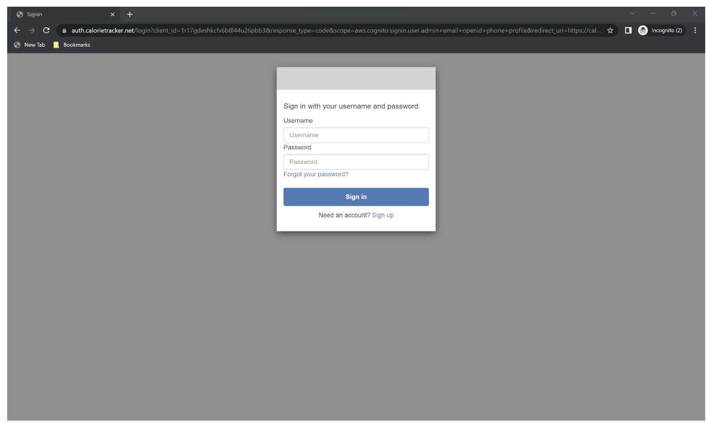
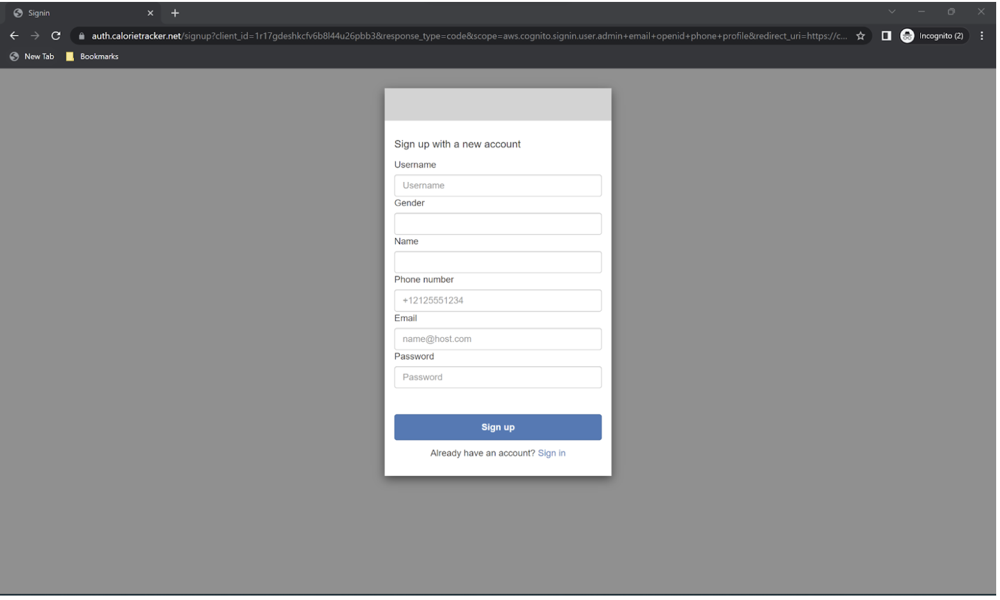
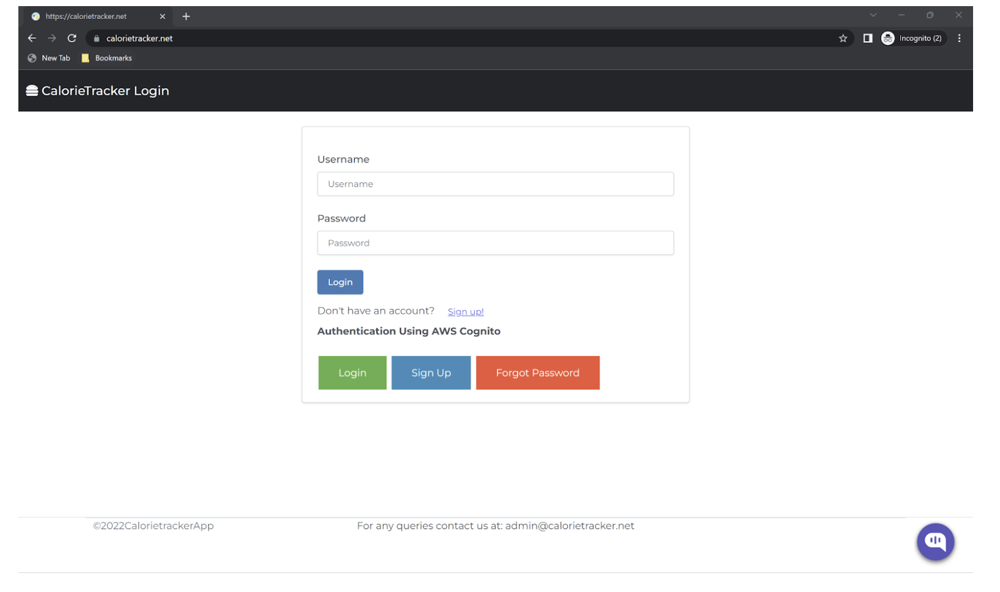

# Introduction

* Cloud Project- 2 : EatWellLiveWell-Calorietracker Application [https://calorietracker.net]

* University Name : http://www.sjsu.edu/

* Course : Cloud Technologies- CMPE281

* Professor : [Sanjay Garje](https://www.linkedin.com/in/sanjaygarje/)

* Students : 
Team Name: CloudBloom<br/> <br/>
Team Members:
* [sirisha polisetty](https://www.linkedin.com/in/sirishapolisetty/) <br/>
* [Bhavya Hegde](https://www.linkedin.com/in/bhavya-hegde/) <br/>
* [Darshini Venkatesha Murthy Nag](https://www.linkedin.com/in/darshini-venkatesha-murthy-nag/) <br/>
* [Blessy Dickson Daniel Moses](https://www.linkedin.com/in/blessy-dickson/) <br/>
<hr>

# Problem statement

## User Features:
* 
* 
* 
* 
* 
* 
* 
* 

## Admin Features:
* Admin can add/view new users and add new food categories.
* Admin can add new foods or modify food items and its details.
* Admin can also revoke access to users or remove food items and its details.


## Tools and Technologies used:
  * Frontend: HTML,Javascript,Bootstrap,ChartJs
  * Backend:Python Django framework
  * Other tools: GitHub actions for CI/CD,Visual studio code/any editor,Docker.
  
  
## Architecture Diagram

## AWS components
* RDS: PostgreSQL is used as the database for the application to store all the user and food details.
* ElastiCache: Memcache is used to render models  to the application quickly by caching responses from RDS.
* Redshift ML: A redshift cluster has been created to import data from the database and then the model is created by running a K-means clustering algorithm.The clusters that are created can be used to provide targeted experiences for the various clusters of users.
* SageMaker: Redshift ML uses sagemaker internally to create training models and run the in-built machine learning algorithms.
* Cognito:Aws Cognito is used to manage user authentications for calorie tracker.
* Route53:Route53 Setup done by adding a A Record to the domain for the alias of cloud front distribution created by Custom Domain Name setup of aws Cognito.
* AWS Certificate Manager: AWS Certificate Manager has been created and validated to allow https traffic to auth flow.

## CI/CD Pipeline
* github workflows, Amazon S3, ubuntu  crontab, and docker for CI/CD of this project.

### Instructions to run project locally

## Create a virtual environment
```
python -m venv venv
  ```
## Activate the virtual environment

* macOS:
```
source venv/bin/activate
```

* Windows:
```

venv\scripts\activate
```

## Install required dependencies
```
pip install -r requirements.txt
```

## Set up environment variables
```
touch .env
```
* We need to add below details in env
```
SECRET_KEY=''
DEBUG=True
DATABASE_NAME=''
DATABASE_USER=''
DATABASE_PASS=''
DATABASE_HOST=''
COGNITO_REGION_NAME=''
USER_POOL_ID=''
CLIENT_ID=''
CLIENT_SECRET=''
TOKEN_ENDPOINT=''
REDIRECT_URI=''
ELASTICACHE_HOST=''
AWSAccessKeyId=''
AWSSecretKey=''
REGION_NAME=''
```

## Run migrations
```
python manage.py makemigrations
python manage.py migrate
```

## Create an admin user to access the Django Admin interface
```
python manage.py createsuperuser
```

## Run the application
```

python manage.py runserver
```

## Sample Demo screenshots




