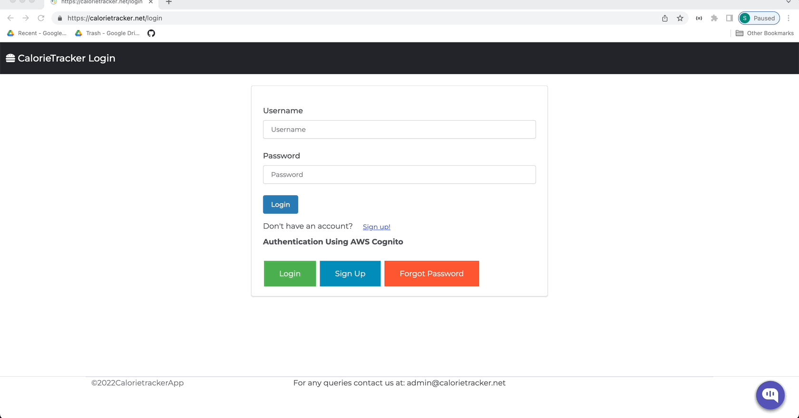
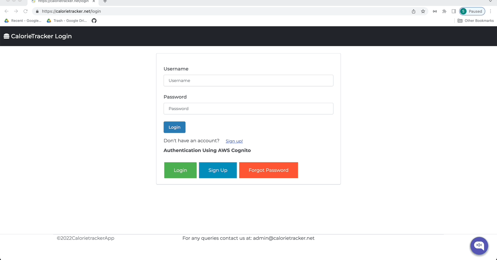

# Introduction

Cloud Project - 2 : EatWellLiveWell-Calorietracker Application [https://calorietracker.net]

University Name : [San Jose State University](https://www.sjsu.edu/)

Course Name : Cloud Technologies - CMPE281

Professor's Name : [Sanjay Garje](https://www.linkedin.com/in/sanjaygarje/) <br/>

ISA : [Supreetha M A](https://www.linkedin.com/in/supreethama/) <br/>

Team Name: Cloud Bloom
- Team Members:
- [Sirisha Polisetty](https://www.linkedin.com/in/sirishapolisetty/)
- [Bhavya Hegde](www.linkedin.com/in/bhavya-hegde-145b9b123)
- [Darshini Venkatesha Murthy Nag](https://www.linkedin.com/in/darshini-venkatesha-murthy-nag-90052756/)
- [Blessy Dickson Daniel Moses](https://www.linkedin.com/in/blessy-dickson-348a31133/) 

## Problem Statement
Obesity is a common and serious disease which is raising day by day and needs to be addressed. Keeping a healthy Lifestyle and Good Exercise Regime helps control it.
In addition to having good exercise regime, one needs to eat a well balanced healthy meal. This brings forward a requirement for a defined method to track a person's diet and calorie intake. We plan to address this by designing a calorie and nutrient tracking application.

## Solution Proposed
Eat Well Live Well is an application that provides users the features to track daily calorie intake and provide nutritional information on macro nutrients such as fat, carbohydrates, protein for the food item consumed by the user. User’s can also monitor their weight by logging their weights in the application which can be visualized from a graph, and it also provides nutrition facts for a range of food items which empowers the user's to plan their diet and reach their fitness goals. 

## Application Features
* Users can register and login using application custom login or through Amazon Cognito
* On successful Login, users can view list of food items
* Users can add new food items
* Users can view macronutrient breakdown for a particular food item
* Users can add the food they have consumed in a day in the food log to know about the total calories consumed and the macronutrients breakdown. 
* Users can log their weight and can see their weight history plotted in the form of a graph

## Admin Features:
* Admin can add/view new users and add new food categories.
* Admin can add new foods or modify food items and its details.
* Admin can also revoke access to users or remove food items and its details.


## Tools and Technologies used:
  * Frontend: HTML, Javascript, Bootstrap, ChartJs
  * Backend: Python Django framework
  * Other tools: GitHub actions for CI/CD, Visual studio code/any editor, Docker.
  
  
## Architecture Diagram


## AWS components
* **Amazon RDS** : PostgreSQL is used as the database for the application to store all the user and food details.
* **Amazon ElastiCache** : Memcache is used to render models  to the application quickly by caching responses from RDS.
* **Amazon Redshift ML** : A redshift cluster has been created to import data from the database and then the model is created by running a K-means clustering algorithm.The clusters that are created can be used to provide targeted experiences for the various clusters of users.
* **Amazon SageMaker** : Redshift ML uses sagemaker internally to create training models and run the in-built machine learning algorithms.
* **Amazon Cognito** : AWS Cognito is used to manage user authentications for calorie tracker.
* **Amazon Route53** : Route53 Setup done by adding a A Record to the domain for the alias of cloud front distribution created by Custom Domain Name setup of aws Cognito.
* **AWS Certificate Manager** : AWS Certificate Manager has been created and validated to allow https traffic to auth flow.
* **Amazon S3** : Amazon S3 buckets are used to store application Images, Sagemaker data dump and CI/CD pipeline application data.
* **S3 Transfer Acceleration** : S3 transfer acceleration is enabled to promote faster file upload to S3 bucket.
* **Amazon CloudFront** : Amazon CloudFront is used to render application Images.
* **AWS Lambda** : Lambda function created for application S3 bucket is used to trigger email to admin when images are uploaded to S3 bucket.
  Lambda function created for Amazon Lex chatbot is used to fetch the calories of the food items from the dynamoDB.
* **Amazon Simple Notification Service (SNS)** : SNS topic is created for sending email to admin once images are uploaded to S3 bucket.
* **Amazon EC2** : Deployed our web application on EC2 using nginx webserver. Gunicorn serves as the web server gateway interface between our application and the nginx server.
* **Elastic Load Balancer (ALB)** : Used Elastic load balancing to distribute web application traffic to 6 availability zones. This automatically distributes application traffic across multiple targets in one or more availability zones.
* **Auto Scaling Groups** : Auto scaling group has been configured if the CPU utilization of the webserver crosses 80% it will spawn a new instance. <br/>
* **Amazon CloudWatch** : A monitoring service to keep track of the health and utilization of resources. 
* **Amazon Lex** : User's can quickly know about calories in a  given food item with the help of a chatbot without logging into the application. 
* **Amazon DynamoDB** : Food name and calorie details will be stored in dynamoDB which renders the calorie data when an lambda function is triggered to fulfill the lex intent. 
* **Amazon Rekognition** : Rekognition has been used to detect the food which has been uploaded by the user and if the labels returned  match the labels present in the application then the food is added automatically to the food log.

  
  

#### CI/CD Pipeline
* GitHub workflows, Amazon S3, Ubuntu  crontab, and Docker for CI/CD of this project.

## Instructions to run project locally

#### Create a virtual environment
```
python -m venv venv
  ```
#### Activate the virtual environment

* macOS:
```
source venv/bin/activate
```

* Windows:
```

venv\scripts\activate
```

#### Install required dependencies
```
pip install -r requirements.txt
```
#### Set up a PostgreSQL database
* With PostgreSQL up and running, in a new Terminal window run:
```
dropdb --if-exists food
```
* Start psql, which is a terminal-based front-end to PostgreSQL, by running the command:
```
psql postgres
```
### Create a new PostgreSQL database:
```
CREATE DATABASE food;
```
Create a new database admin user:
```
CREATE USER yourusername WITH SUPERUSER PASSWORD 'yourpassword';
```
#### To quit psql, run:
```
\q
```

#### Set up environment variables
```
touch .env
```
#### We need to add below details in env
```
SECRET_KEY=''
DEBUG=True
DATABASE_NAME=''
DATABASE_USER=''
DATABASE_PASS=''
DATABASE_HOST=''
COGNITO_REGION_NAME=''
USER_POOL_ID=''
CLIENT_ID=''
CLIENT_SECRET=''
TOKEN_ENDPOINT=''
REDIRECT_URI=''
ELASTICACHE_HOST=''
AWSAccessKeyId=''
AWSSecretKey=''
REGION_NAME=''
```

#### Run migrations
```
python manage.py makemigrations
python manage.py migrate
```

#### Create an admin user to access the Django Admin interface
```
python manage.py createsuperuser
```

#### Run the application
```
python manage.py runserver
```

## Sample Demo screenshots
#### Chatbot:

#### Login Page:

####  Food List Page :

#### Food details page:

#### Food Log page:

#### Weight Log page:


## References
Amazon Documentation : https://docs.aws.amazon.com/ <br/>
Images :  https://www.pexels.com/ <br/>
ChartJS:  https://www.youtube.com/watch?v=sE08f4iuOhA <br/>
Lex Bot Integration: https://www.kommunicate.io/ <br/>
Machine learning:<br/>
https://aws.amazon.com/blogs/machine-learning/k-means-clustering-with-amazon-sagemaker/ <br/>
https://aws.amazon.com/blogs/big-data/use-unsupervised-training-with-k-means-clustering-in-amazon-redshift-ml/ <br/>
Deploy django app with https,gunicorn and Nginx : https://realpython.com/django-nginx-gunicorn/ <br/>
Nginx conf on EC2: https://dzone.com/articles/aws-applications-deployment-basics-setup-nginx  <br/>
Gunicorn WSGI service setup: https://www.digitalocean.com/community/tutorials/how-to-set-up-django-with-postgres-nginx-and-gunicorn-on-ubuntu-20-04 <br/>
